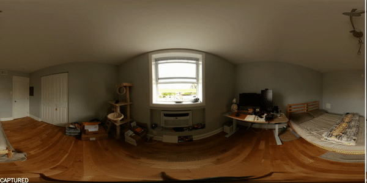

# Virtual Home Staging

This repository includes source code for the oral presentation paper ["Virtual Home Staging: Inverse Rendering and Editing an Indoor Panorama under Natural Illumination"](https://arxiv.org/abs/2311.12265) at the International Symposium on Visual Computing, Lake Tahoe, NV, Oct. 16-18, 2023. 



## Indoor-Outdoor HDR Photography
See [detailed implementation](https://github.com/Gzhji/vs_natural_ill/tree/main/01_HDR_Calibration) 

## Furniture Detection and Removal
See [Furniture Detection](https://github.com/Gzhji/vs_natural_ill/tree/main/02_Furn_Detect) 

See [Furniture Removal](https://github.com/Gzhji/vs_natural_ill/tree/main/02_Furn_Removal)

## Rendering Preparation
See [Window Detection](https://github.com/Gzhji/vs_natural_ill/tree/main/02_Win_Detection)

See [3D Layout](https://github.com/Gzhji/vs_natural_ill/tree/main/03_3DFloor_Mesh)

See [Texture Preparation](https://github.com/Gzhji/vs_natural_ill/tree/main/03_Reflectance_Tex)

## Virtual Staging
See [detailed implementation]([https://github.com/Gzhji/vs_natural_ill/tree/main/01_HDR_Calibration](https://github.com/Gzhji/vs_natural_ill/tree/main/05_Virtual_Render)) 


## BibTeX
```
@inproceedings{ji2023virtual,
    title = {Virtual Home Staging: Inverse Rendering and Editing an Indoor Panorama under Natural Illumination},
    author = {Ji, Guanzhou and Sawyer, Azadeh 0. and Narasimhan, Srinivasa G.},
    booktitle = {International Symposium on Visual Computing, Lake Tahoe, NV},
    year = {2023},
}
```
